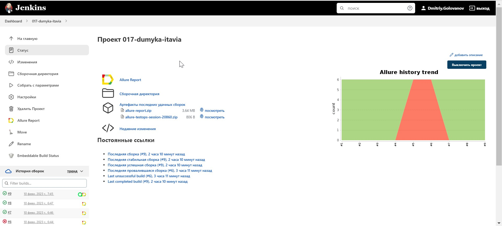
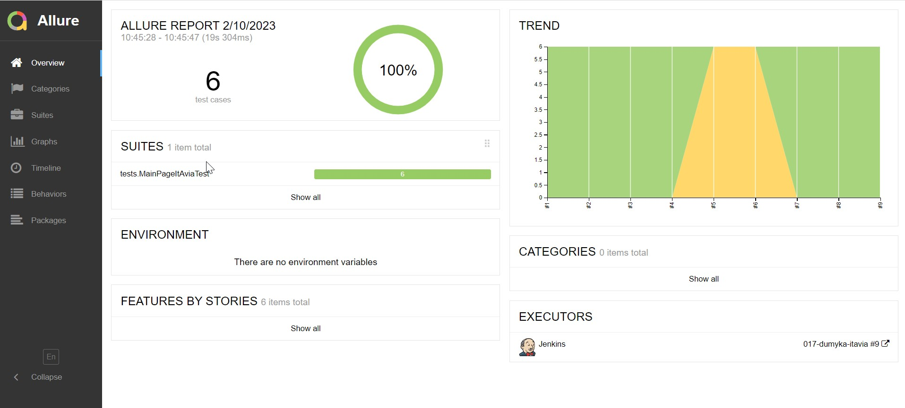

# Проект по автоматизации тестирования главной страницы itavia.ru


## :man_student:: Содержание:

- [Стек технологий](#earth_africa-Стек-технологий)
- [Реализованные проверки](#earth_africa-Реализованные-проверки)
- [Сборка в Jenkins](#earth_africa-Jenkins-job)
- [Запуск из терминала](#earth_africa-Запуск-тестов-из-терминала)
- [Allure отчет](#earth_africa-Allure-отчет)
- [Интеграция с Allure TestOps](#earth_africa-Интеграция-c-Allure-TestOps)
- [Интеграция с Jira](#earth_africa-Интеграция-c-Jira)
- [Уведомления в Telegram](#earth_africa-Уведомление-в-Telegram-при-помощи-бота)
- [Видео примеры прохождения тестов](#earth_africa-Примеры-видео-о-прохождении-тестов)

## 🧰: Стек технологий

<p align="center">
<a href="https://www.jetbrains.com/idea/"></a>
<a href="https://www.java.com/"></a>
<a href="https://github.com/"></a>
<a href="https://junit.org/junit5/"></a>
<a href="https://gradle.org/"></a>
<a href="https://selenide.org/"></a>
<a href="https://aerokube.com/selenoid/"></a>
<a href="https://github.com/allure-framework/allure2"></a>
<a href="https://https://qameta.io/"></a>
<a href="https://www.jenkins.io/"></a>
<a href="https://https://telegram.org/"></a>
</p>

## :male_detective:: Реализованные проверки

Автаматизированные тесты
- ✓ Страница CARRIER содержит информацию об CARRIER.AERO 
- ✓ Страница PORT содержит информацию о PORT.AERO
- ✓ Страница AGENCY содержит информацию об AGENCY.AERO
- ✓ Страница Реквизиты содержит реквизиты компании OOO АйТи Авиа
- ✓ Переход на главную страницу при клике на лого сайта
- ✓ Cтраница EDIFLY содержит информацию о EDIFLY - Innovative Software SARL

Ручные тесты
- ✓ Работа слайдера на главной странице
- ✓ Отправка сообщения из формы обратной связи

## </a> Сборка <a target="_blank" href="https://jenkins.autotests.cloud/job/017-dumyka-itavia/"> Jenkins </a>
<p align="center">
<a href="https://jenkins.autotests.cloud/job/017-dumyka-itavia/"></a>
</p>

## :hammer_and_wrench:: Параметры сборки в Jenkins:
- remote (адрес удаленного сервера)
- browserSize (размер окна браузера, по умолчанию 1920x1080)
- browserVersion (версия браузера, по умолчанию 100.0)
- browser (браузер, по умолчанию chrome)

## :rocket:: Запуск тестов
Локальный запуск:
```
gradle clean test
```

Удаленный запуск:
```
clean
test
-Dremote=${REMOTE}
-DbrowserSize=${BROWSER_SIZE}
-DbrowserVersion=${BROWSER_VERSION}
-Dbrowser=${BROWSER}
```

## </a> Allure отчет <a target="_blank" href="https://jenkins.autotests.cloud/job/IBS_test/allure/"></a>

## ⛅: Основной отчет
<p align="center">

</p>
C:\Users\Dmitriy.Golovanov\IdeaProjects\ITAvia\images\screens\Allure.jpg
